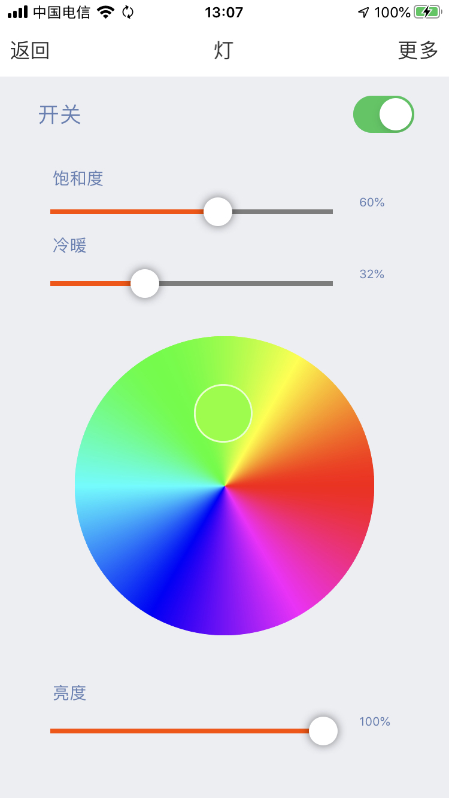

# Tuya Smart iOS SDK

[中文版](README-zh.md) | [English](README.md)

---

## Features Overview

This project is developed using [Tuya App SDK](https://github.com/tuya/tuya-home-ios-sdk), which enables you to quickly develop branded apps connecting and controlling smart scenarios of many devices.

For more information, please check [Tuya Developer Website](https://developer.tuya.com/en/docs/iot/app-development/sdk-development/app-sdk-instruction?id=K9kjstc7t376p).

### ScreenShot

